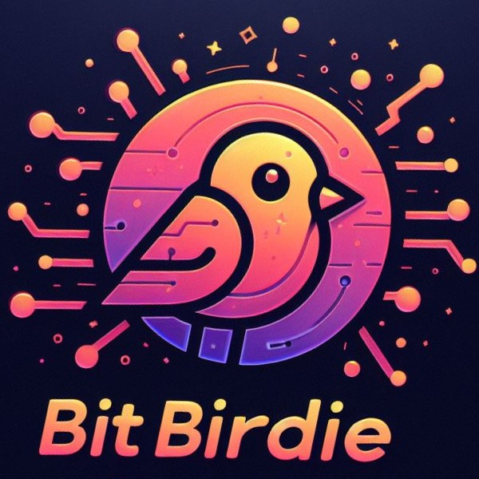

# BitBirdie

## Overview:
BitBirdie is an AI-powered cryptocurrency wallet designed to simplify web3 transactions using natural language processing. Built with Okto wallet and AI technology, BitBirdie aims to make crypto accessible to all.

## Features:
- **Natural Language Interface:** Perform transactions and interact with the blockchain using simple commands.
- **Transaction Management:** Transfer SOL, buy/sell tokens, swap tokens, interact with smart contracts, view balances, and transaction history.
- **Address Book:** Easily manage contacts for seamless transactions.
- **Future Enhancements:** Set limit orders, dollar-cost averaging, price alerts, and market insights.

## How to Use:
1. Install BitBirdie on your device.
2. Connect with your Google account that creates a secure self custodial wallet
3. Use natural language commands to perform transactions and manage your crypto assets.
4. Explore additional features and stay tuned for updates.

## Contributing:
- We welcome contributions from Web3 developers and AI enthusiasts.
- Fork the repository, make your changes, and submit a pull request.
- For major changes, please open an issue to discuss potential updates.

## Support:
- For assistance or inquiries, contact [dsouzajovian123@gmail.com](mailto:dsouzajovian123@gmail.com).
- Join our community on [Twitter](https://twitter.com/bitbirdie21001) for updates and announcements.

## License:
BitBirdie is licensed under the MIT License. See [LICENSE](LICENSE) for details.

## Acknowledgments:
We would like to thank the open-source community for their invaluable contributions to BitBirdie.

## Disclaimer:
BitBirdie is provided "as is" without warranty of any kind. Use at your own risk.

## Demo:
- 🌏 [BitBirdie](https://bitbirdie.vercel.app/)

## Connect with Us:
- Website: [bitbirdie.vercel.app](https://bitbirdie.vercel.app/)
- Twitter: [twitter.com/bitbirdie21001](https://twitter.com/bitbirdie21001)

## Stay Informed:
- Subscribe to our newsletter for the latest updates and announcements.

**Thank you for choosing BitBirdie!**
